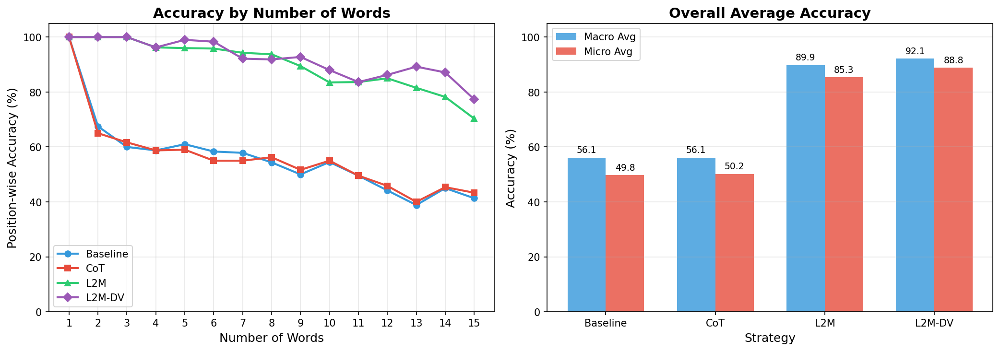

# L2M-improve

빅데이터와 정보검색 기말고사를 위한 L2M-DV 모델 제안 및 실험

## baseline vs CoT vs L2M vs L2M-DV

| 항목         | 조건    |
| ------------ | ------- |
| batch size   | 20      |
| LLM Model    | gpt-4o  |
| words number | 1 -> 15 |

# 실험 (last-letter-concatenation task)

### Batch Summary (n_words=15)

| Strategy | Accuracy | Tokens | Avg Time |
| -------- | -------- | ------ | -------- |
| Baseline | 41.33%   | 7,795  | 1.109s   |
| CoT      | 43.33%   | 8,292  | 1.170s   |
| L2M      | 70.33%   | 16,472 | 4.385s   |
| L2M-DV   | 77.33%   | 18,953 | 5.416s   |

### Average position-wise accuracy

| Strategy | Macro / Micro   | Exact Match |
| -------- | --------------- | ----------- |
| Baseline | 56.08% / 49.75% | EM: 11.33%  |
| CoT      | 56.09% / 50.21% | EM: 10.00%  |
| L2M      | 89.85% / 85.33% | EM: 61.67%  |
| L2M-DV   | 92.13% / 88.83% | EM: 65.67%  |

### Token Usage & Time

| Strategy | Token Usage (Total) | Average Time (sec) |
| -------- | ------------------- | ------------------ |
| Baseline | 110,072 tokens      | 1.099s             |
| CoT      | 117,397 tokens      | 1.165s             |
| L2M      | 200,356 tokens      | 3.027s             |
| L2M-DV   | 231,985 tokens      | 3.468s             |

### Position-wise Accuracy by Number of Words (%)

| n_words | Baseline | CoT    | L2M    | L2M-DV |
| ------- | -------- | ------ | ------ | ------ |
| 1       | 100.00   | 100.00 | 100.00 | 100.00 |
| 2       | 67.50    | 65.00  | 100.00 | 100.00 |
| 3       | 60.00    | 61.67  | 100.00 | 100.00 |
| 4       | 58.75    | 58.75  | 96.25  | 96.25  |
| 5       | 61.00    | 59.00  | 96.00  | 99.00  |
| 6       | 58.33    | 55.00  | 95.83  | 98.33  |
| 7       | 57.86    | 55.00  | 94.29  | 92.14  |
| 8       | 54.37    | 56.25  | 93.75  | 91.88  |
| 9       | 50.00    | 51.67  | 89.44  | 92.78  |
| 10      | 54.50    | 55.00  | 83.50  | 88.00  |
| 11      | 49.55    | 49.55  | 83.64  | 83.64  |
| 12      | 44.17    | 45.83  | 85.00  | 86.25  |
| 13      | 38.85    | 40.00  | 81.54  | 89.23  |
| 14      | 45.00    | 45.36  | 78.21  | 87.14  |
| 15      | 41.33    | 43.33  | 70.33  | 77.33  |

### 종합 분석

| 항목    | Baseline | CoT     | L2M     | L2M-DV  |
| ------- | -------- | ------- | ------- | ------- |
| Micro   | 49.75    | 50.21   | 85.33   | 88.83   |
| Macro   | 56.08    | 56.09   | 89.85   | 92.13   |
| EM      | 11.33    | 10.00   | 61.67   | 65.67   |
| Tokens  | 110,072  | 117,397 | 200,356 | 231,985 |
| Time(s) | 1.099    | 1.165   | 3.027   | 3.468   |
