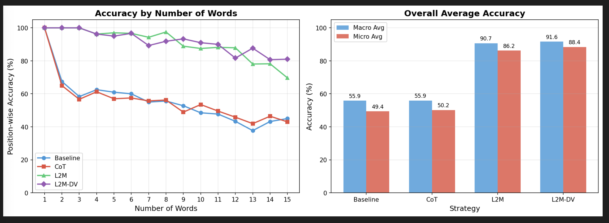
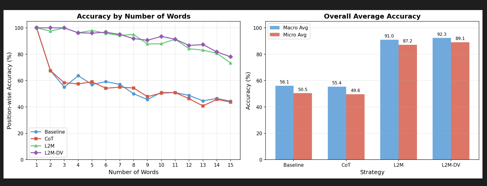

# L2M-improve

## baseline vs CoT vs L2M vs L2M-DV

| 항목         | 조건    |
| ------------ | ------- |
| batch size   | 20      |
| LLM Model    | gpt-4o  |
| words number | 1 -> 15 |

## 실험 1

## 실험 2

