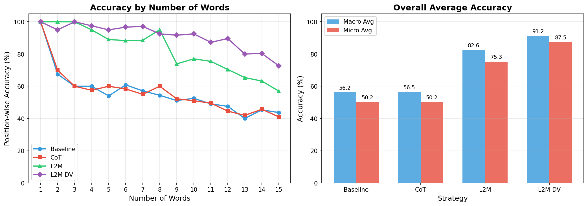

# L2M-improve

빅데이터와 정보검색 기말고사를 위한 L2M-DV 모델 제안 및 실험

## baseline vs CoT vs L2M vs L2M-DV

| 항목         | 조건    |
| ------------ | ------- |
| batch size   | 20      |
| LLM Model    | gpt-4o  |
| words number | 1 -> 15 |

# 실험 (last-letter-concatenation task)

## 항목 설명

### Accuracy

위치별(position-wise) 정확도. 각 글자 위치에서 정답과 일치하는지 비교.

### Micro Accuracy

전체 prediction에서 맞춘 글자 수의 총합 / 전체 gold 글자 수의 총합
(글자 수가 많은 문제에 더 큰 가중치)

### Macro Accuracy

각 문제별 정확도의 평균
(모든 문제에 동일한 가중치)

### Batch Summary (n_words=15)

| Strategy | Accuracy | Tokens | Avg Time |
| -------- | -------- | ------ | -------- |
| Baseline | 43.67%   | 7,895  | 1.261s   |
| CoT      | 41.00%   | 8,292  | 1.233s   |
| L2M      | 57.00%   | 12,703 | 2.884s   |
| L2M-DV   | 72.67%   | 17,357 | 4.062s   |

### Average position-wise accuracy

| Strategy | Macro / Micro   | Exact Match |
| -------- | --------------- | ----------- |
| Baseline | 56.21% / 50.25% | EM: 11.33%  |
| CoT      | 56.45% / 50.21% | EM: 11.33%  |
| L2M      | 82.55% / 75.29% | EM: 50.00%  |
| L2M-DV   | 91.19% / 87.46% | EM: 63.67%  |

### Token Usage & Time

| Strategy | Token Usage (Total) | Average Time (sec) |
| -------- | ------------------- | ------------------ |
| Baseline | 110,111 tokens      | 1.064s             |
| CoT      | 117,398 tokens      | 1.068s             |
| L2M      | 169,496 tokens      | 2.181s             |
| L2M-DV   | 239,966 tokens      | 3.443s             |

### Position-wise Accuracy by Number of Words (%)

| n_words | Baseline | CoT    | L2M    | L2M-DV |
| ------- | -------- | ------ | ------ | ------ |
| 1       | 100.00   | 100.00 | 100.00 | 100.00 |
| 2       | 67.50    | 70.00  | 100.00 | 95.00  |
| 3       | 60.00    | 60.00  | 100.00 | 100.00 |
| 4       | 60.00    | 57.50  | 95.00  | 97.50  |
| 5       | 54.00    | 60.00  | 89.00  | 95.00  |
| 6       | 60.83    | 58.33  | 88.33  | 96.67  |
| 7       | 57.14    | 55.00  | 88.57  | 97.14  |
| 8       | 54.37    | 60.00  | 95.00  | 92.50  |
| 9       | 51.11    | 52.22  | 73.89  | 91.67  |
| 10      | 52.50    | 51.00  | 77.00  | 92.50  |
| 11      | 49.09    | 49.55  | 75.45  | 87.27  |
| 12      | 47.50    | 44.58  | 70.42  | 89.58  |
| 13      | 40.00    | 41.92  | 65.38  | 80.00  |
| 14      | 45.36    | 45.71  | 63.21  | 80.36  |
| 15      | 43.67    | 41.00  | 57.00  | 72.67  |

### 종합 분석

| 항목    | Baseline | CoT     | L2M     | L2M-DV  |
| ------- | -------- | ------- | ------- | ------- |
| Micro   | 50.25    | 50.21   | 75.29   | 87.46   |
| Macro   | 56.21    | 56.45   | 82.55   | 91.19   |
| EM      | 11.33    | 11.33   | 50.00   | 63.67   |
| Tokens  | 110,111  | 117,398 | 169,496 | 239,966 |
| Time(s) | 1.064    | 1.068   | 2.181   | 3.443   |
